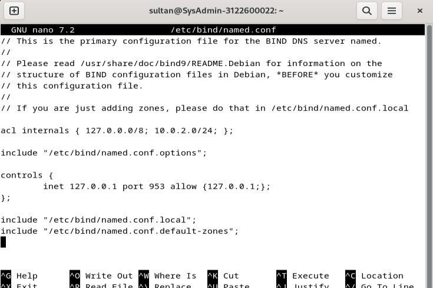

# SETUP DNS Server Debian Bookworm

---

## 1. Siapkan Package

---

### 1.1 Update & Upgrade APT

```bash
sudo apt update
sudo apt upgrade
```


---

### 1.2 Install Package yang Diperlukan

```bash
sudo apt install bind9 bind9-dnsutils bind9-doc
```


---

## 2. Konfigurasi Bind9

---

### 2.1 Konfigurasi file named.conf

```bash
sudo nano /etc/bind/named.conf
```



---

### 2.2 Konfigurasi file named.conf.options

```bash
sudo nano /etc/bind/named.conf.options
```


---

### 2.3 Konfigurasi file named.conf.local

```bash
sudo nano /etc/bind/named.conf.local
```


---

### 2.4 Check named config

```bash
sudo named-checkconf /etc/bind/named.conf
```


---

### 2.5 Konfigurasi db.kelompok2.local

```bash
sudo nano /var/lib/bind/db.kelompok2.local
```


---

### 2.6 Konfigurasi db.kelompok2.local.inv

```bash
sudo nano /var/lib/bind/db.kelompok2.local.inv
```


---

### 2.7 Check dblocal config

```bash
cd /var/lib/bind/
sudo named-checkzone kelompok2.local db.kelompok2.local
sudo named-checkzone 136.168.192.inaddr-arpa db.kelompok2.local.inv
```


---

### 2.8 Konfigurasi resolv.conf

```bash
sudo nano /etc/resolv.conf
```


---

### 2.9 Restart named

```bash
sudo systemctl restart named
sudo systemctl status named
```


---

## 3 Uji DNS

---

```bash
dig kelompok2.local
```


---

```bash
dig -x 10.0.2.15
```


---

```bash
nslookup ns
```


