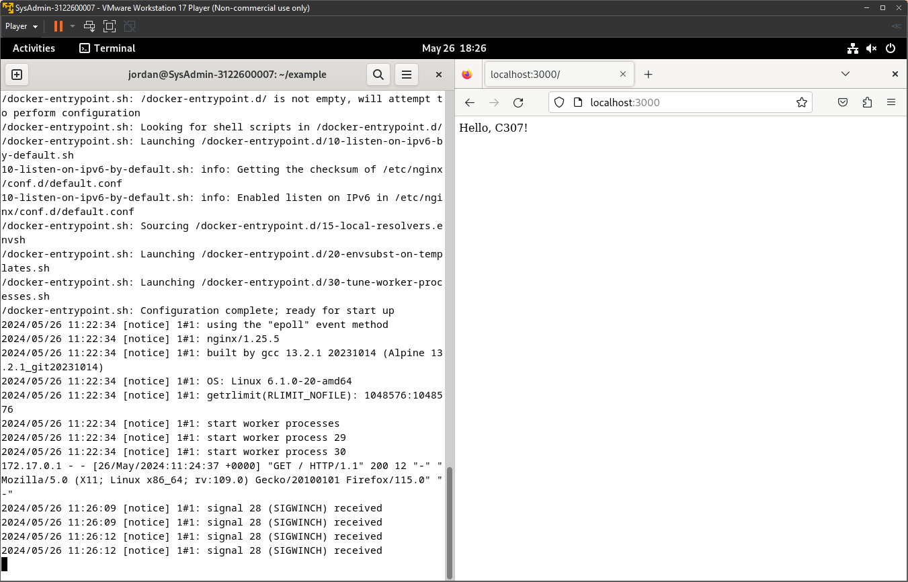

# Menjalankan Image Docker

### Step 1: Clone Image

1. Buka terminal.
2. Jalankan command:

   ```bash
   git clone https://github.com/alfiyansys/docker-examples.git
   ```

### Step 2: Build Image

1. Buka terminal.
2. Jalankan command:

   ```bash
   cd example
   sudo docker build -t example
   ```

### Step 3: Menjalankan Image

1. Buka terminal.
2. Jalankan command:

   ```bash
   sudo docker run -p 3000:3000 example
   ```

3. Buka browser pada url `localhost:3000`
    <div align="center">
        
        <p><strong>Gambar 1:</strong> example docker image</p>
    </div>

> Terima kasih
