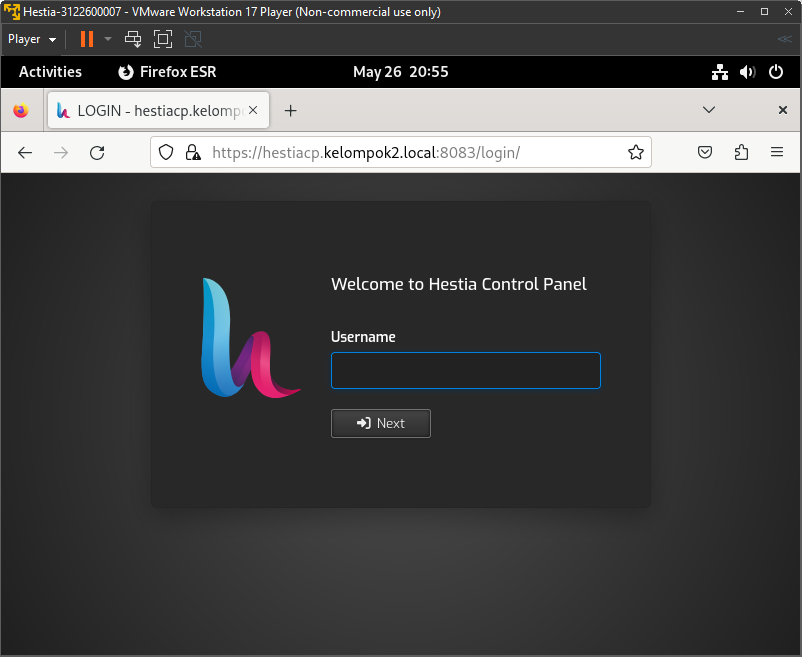

# Instalasi Hestia Control Panel pada Debian 12

### Step 1: Preparation

1. Install Debian VM baru pada virtualization tools yang digunakan (VMWare, Virtualbox, dll).

### Step 2: Instalasi dan konfigurasi

1. Setelah VM diinstall dan disetup, masuk ke mode root pada terminal.
2. Install Hestia CP dengan menjalankan command:

   ```bash
   wget https://raw.githubusercontent.com/hestiacp/hestiacp/release/install/hst-install.sh
   ```

3. Selanjutnya, konfigurasi Hestia CP dengan menjalankan command:

    ```bash
    bash hst-install.sh
    ```

4. Masukkan email dan FQDN sebagai berikut:

    ```
    email: jordan@mail.kelompok2.local
    FQDN: hestiacp.kelompok2.local
    ```

### Step 3: Menjalankan Hestia CP

1. Buka browser di url `hestiacp.kelompok2.local:8083` maka akan muncul tampilan dari Hestia CP
    <div align="center">
        
        <p><strong>Gambar 1:</strong> Hestia CP</p>
    </div>

> Terima kasih
