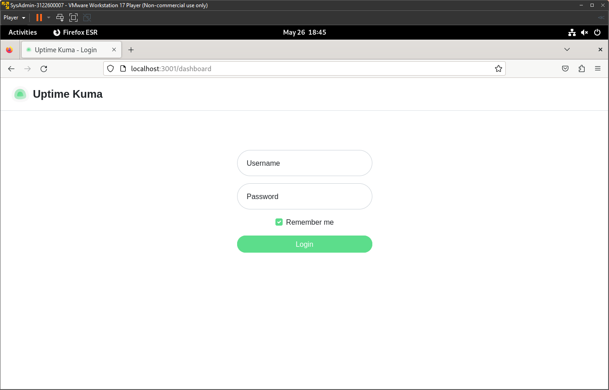

# Docker Based Uptime Kuma (Network Monitoring Tool)

### Step 1: Instalasi

1. Buka terminal.
2. Jalankan command:

   ```bash
   sudo docker run -d --restart=always -p 3001:3001 -v uptime-kuma:/app/data --name uptime-kuma louislam/uptime-kuma:1
   ```

### Step 2: Menjalankan Uptime Kuma

1. Karena command pada step 1 sudah otomatis menginstall dan menjalankan image Uptime Kuma, maka selanjutnya hanya perlu membuka browser pada url `localhost:3001`
    <div align="center">
        
        <p><strong>Gambar 1:</strong> Uptime Kuma</p>
    </div>
