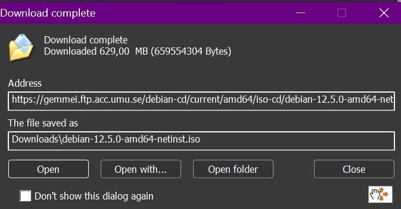
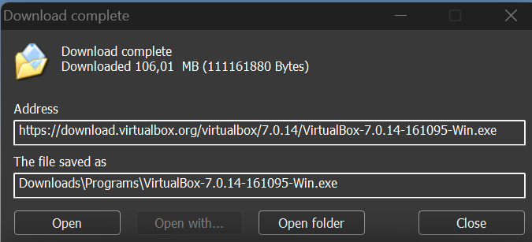

# Instalasi Debian pada Virtual Box

## Persiapan Tools

1. Iso File Debian

2. Virtual Box

## Setup Virtual Machine

1. Buka Virtual Box

*Tampilan awal virtual box*
2. New Virtual Machine

*Klik new, arahkan ISO image ke direktori penyimpanan ISO yang sudah di download, check list pada "Skip Unattended Installation"*
3. Spesifikasi Hardware

*Disini virtual machine saya nantinya akan memiliki 4GB Memory serta 2-Core CPU*
4. Alokasi Storage

*Untuk penyimpanan, buat virtual hard disk dengan space 25GB untuk virtual machine saya*
5. Summary

*Cek kembali, apabila sudah benar klik finish*
6. Virtual Machine telah dibuat

## Setup Debian

1. Pilih bahasa

2. Setup lokasi

*Pilih other->asia->indonesia*
3. Setup locales

*Pilih United States*
4. Setup Keyboard

*Pilih american english untuk keymap, lalu klik continue*
5. Setup network

*Masukkan "SysAdmin-NRP" sebagai hostname*

*Domain name kosongkan, lalu klik continue*
6. Setup root dan user

*Masukkan pasword untuk akses root*

*Masukkan fullname untuk digunakan sebagai user baru(non-root)*

*Masukkan username untuk user yang telah dibuat*

*Masukkan password yang digunakan untuk akses user tadi*
7. Konfigurasi jam

*Pilih western untuk WIB*
8. Format Partisi

*Buat partisi dari alokasi storage tadi untuk / ,/storage, dan swap area*
9. Setup package manager

*Gunakan kebo.pens sebagai package manager*
10. Software selection

*Pilih software untuk di install*
11. Boot GRUB

*Saat pertama kali Machine dijalankan(booting), akan muncul GRUB untuk bisa masuk ke OS yang ada*
