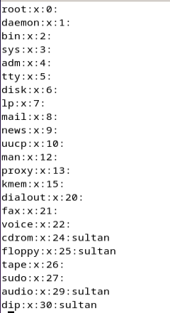

# Less /etc/group

File /etc/group pada sistem Debian (dan distribusi Linux lainnya) berfungsi sebagai penyimpanan informasi tentang grup-grup pengguna yang ada di sistem. Setiap baris dalam file ini mewakili satu grup, dan setiap baris terdiri dari beberapa kolom yang dipisahkan oleh titik dua (":").

Format dari setiap baris dalam file /etc/group adalah sebagai berikut:

```bash
nama_grup:katasandi_grup:id_grup:daftar_anggota
```

Di sini, arti dari masing-masing kolom adalah sebagai berikut:

1. nama_grup: Merupakan nama unik dari grup tersebut.
2. katasandi_grup: Biasanya berisi karakter "x" yang menunjukkan bahwa kata sandi grup disimpan secara terenkripsi dalam file /etc/gshadow. Informasi terkait kata sandi grup tidak disimpan dalam file /etc/group untuk keamanan.
3. id_grup: Merupakan ID numerik yang unik untuk grup tersebut. ID grup digunakan oleh sistem untuk mengidentifikasi grup secara internal.
4. daftar_anggota: Merupakan daftar nama pengguna yang termasuk dalam grup tersebut, dipisahkan oleh koma. Jika grup tidak memiliki anggota, kolom ini dapat kosong.
Sebagai contoh, baris dalam file /etc/group mungkin terlihat seperti ini:

Di sini:
users adalah nama grup.
x menunjukkan bahwa kata sandi grup disimpan secara terenkripsi dalam file /etc/gshadow.
1000 adalah ID numerik untuk grup.
user1, user2, dan user3 adalah anggota dari grup tersebut.
