<!-- headingDivider: 3 -->

## Direktori Debian 12(Bookworm)

Struktur Direktori dalam Unix & Linux adalah struktur Direktori yang terpadu di mana semua direktori disatukan di bawah sistem file Root "/". Terlepas dari di mana Sistem File tersebut dipasang secara fisik, semua direktori diatur secara hierarkis di bawah sistem file Root.
Struktur Direktori Linux mengikuti "Struktur Hirarki Sistem File (FHS)" yang dikelola oleh Kelompok Standar Gratis meskipun sebagian besar distribusi kadang-kadang cenderung menyimpang dari standar tersebut.
Mari kita lihat secara singkat berbagai direktori di bawah Hirarki Sistem File Linux.

## Ilustrasi

<https://whimsical.com/debian-directory-tree-WdaVZtBAcCZqvXjXVXzVpK>

### 1. Root "/"

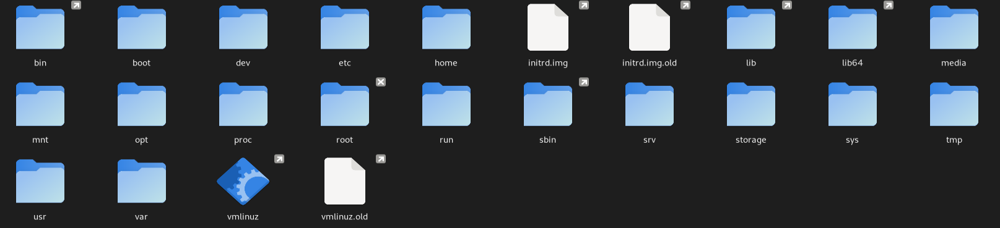
Struktur direktori di debian dimulai dari root "/" yang menjadi dasar dari semua direktori lain. Partisi root "/" akan terletak pada sistem UNIX atau yang kompatibel dengan UNIX.

### 2. /boot

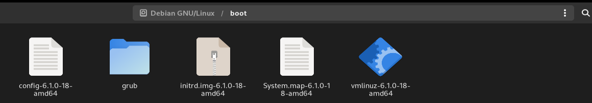
Direktori ini berisi file-file booting seperti GRUB, kernel, initrd, dan system.map config file.

### 3. /sys

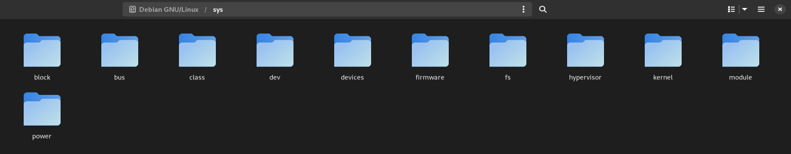
Direktori ini memuat kernel, firmware, serta segala yang berhubungan dengan sistem.

### 4. /sbin

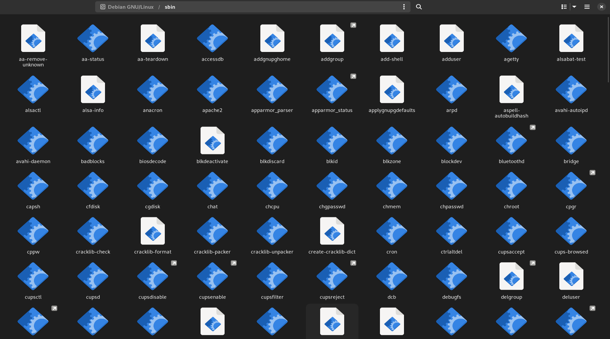

Memuat system binaries serta tools untuk adminisstrasi sistem operasi dan performa.

### 5. /bin

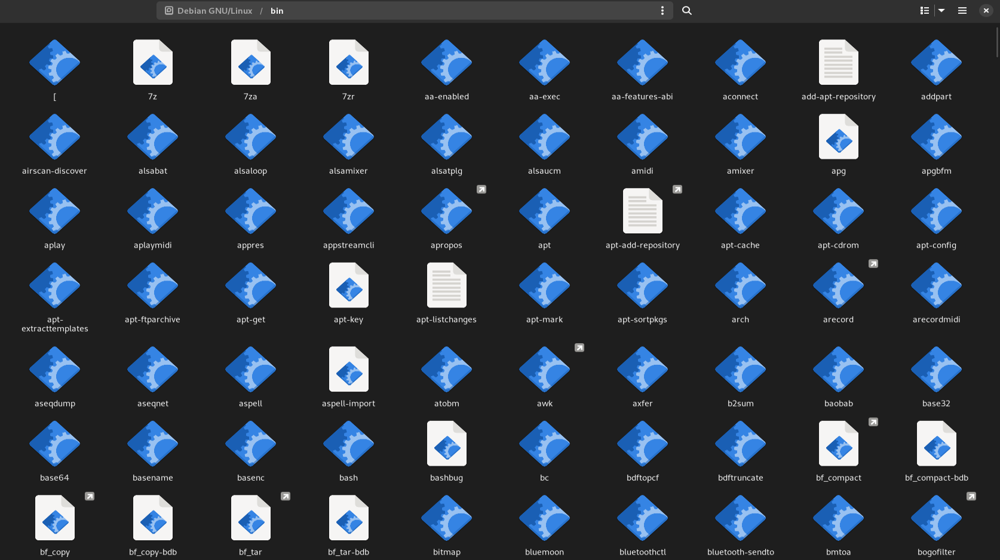

Berisi utility atau command yang berguna untuk user. Seperti cat, ls, cp, dan lainnya.

### 6. /lib

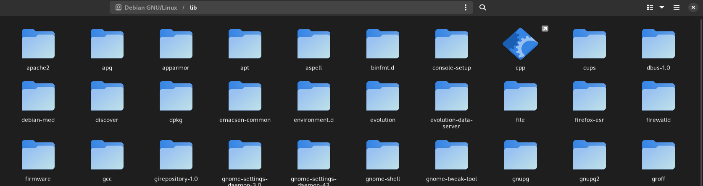
Mengandung file library yang digunakan untuk binary yang ada pada direktori /sbin dan /bin.

### 7. /dev

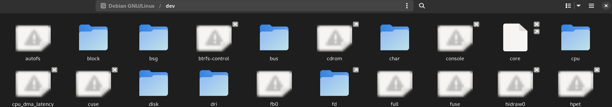
Direktori ini berisi file sistem dan driver-driver penting.

### 8. /etc

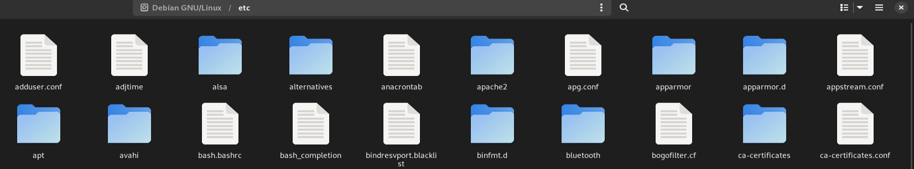
Berisi konfigurasi sistem seperti /etc/hosts, /etc/resolv.conf, nsswitch.conf, serta konfigurasi jaringan. Direktori ini banyak berhubungan dengan konfigurasi aplikasi dan sistem untuk host.

### 9. /home

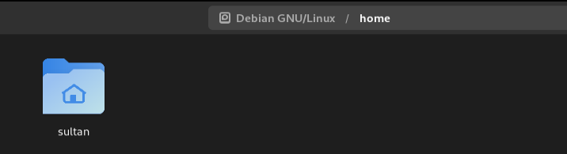
Direktori ini adalah sebagai home directory bagi user yang ada, semua file dan folder user seperti pictures, download, dll berada dalam direktori home ini.

### 10. /media

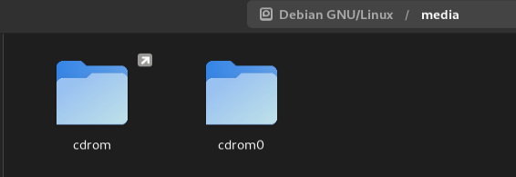
Direktori ini berfungsi sebagai mount point untuk removable media seperti CD-ROM, Flash Disk, dll.

### 11. /mnt

Mount point untuk file sistem sementara(temporary). Dapat berfungsi untuk troubleshooting pemecahan masalah dari CDROM, dll., di mana Anda mungkin harus memasang sistem file Root dan mengedit konfigurasi.

### 12. /opt

Sebuah direktori yang jarang digunakan di Linux untuk Paket Perangkat Lunak Opsional. Ini digunakan secara luas dalam sistem operasi UNIX seperti Sun Solaris di mana paket-paket perangkat lunak diinstal.

### 13. /usr

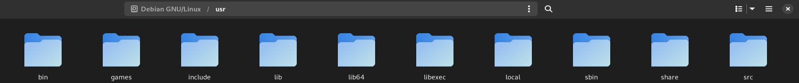
Sebuah sub-hirarki untuk sistem file root yang merupakan direktori data pengguna. Berisi utilitas dan aplikasi khusus pengguna. Anda akan melihat banyak sistem file penting namun tidak kritis dipasang di sini. Di sini Anda akan menemukan direktori bin, sbin, & lib yang berisi binari pengguna dan sistem non-kritis serta pustaka terkait dan sebuah direktori share. Juga ditemukan di sini adalah direktori include dengan berkas include.

### 14. /usr/sbin

Berisi binari sistem non-esensial dan tidak kritis serta utilitas jaringan.

### 15. /usr/bin

Berisi binari perintah non-esensial dan tidak kritis untuk pengguna.

### 16. /usr/lib

Kumpulan library untuk binary didalam /usr/sbin dan /usr/bin.

### 17. /usr/share

Sebuah direktori data bersama yang tidak tergantung pada platform.

### 18. /usr/local

Sebuah sub-hirarki di bawah direktori /usr yang memiliki data Lokal Sistem tertentu termasuk binari pengguna dan sistem beserta pustaka mereka.

### 19. /var

Direktori /var sebagian besar dipasang sebagai sistem file terpisah di bawah root di mana semua konten variabel seperti log, file spool untuk printer, crontab, pekerjaan at, surat, proses yang berjalan, berkas kunci, dll. Perlu diperhatikan dalam merencanakan sistem file ini dan pemeliharaannya karena ini dapat cepat penuh dan ketika sistem file penuh dapat menyebabkan masalah operasional sistem dan aplikasi.

### 20. /tmp

Sebuah sistem file sementara yang menyimpan berkas sementara yang dihapus saat sistem di-reboot. Ada juga direktori /var/tmp yang menyimpan berkas sementara. Satu-satunya perbedaan antara keduanya adalah bahwa direktori /var/tmp menyimpan berkas yang dilindungi saat sistem di-reboot. Dengan kata lain, berkas /var/tmp tidak dihapus saat reboot.

Selanjutnya, ada sistem file virtual (pseudo) /proc yang berada di memori dan dipasang di bawah Root yang menyimpan statistik kernel dan proses dalam format berkas teks.
