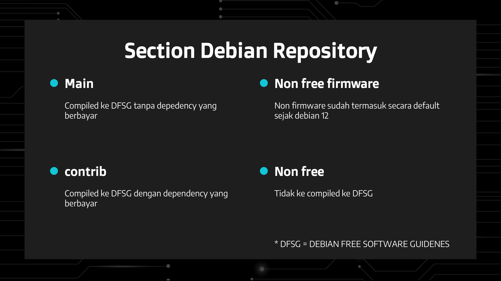
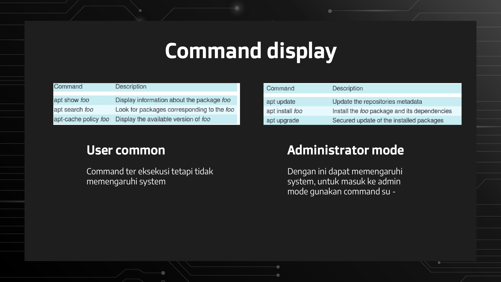
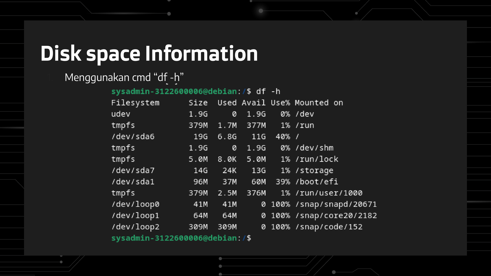
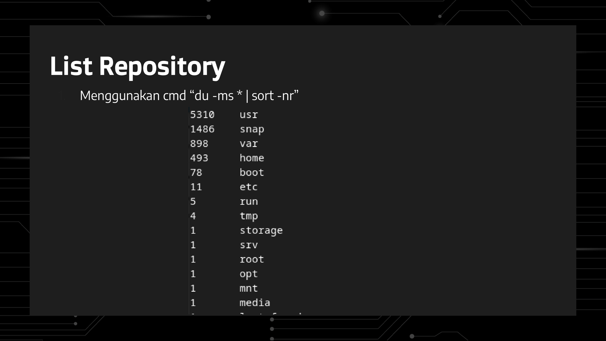
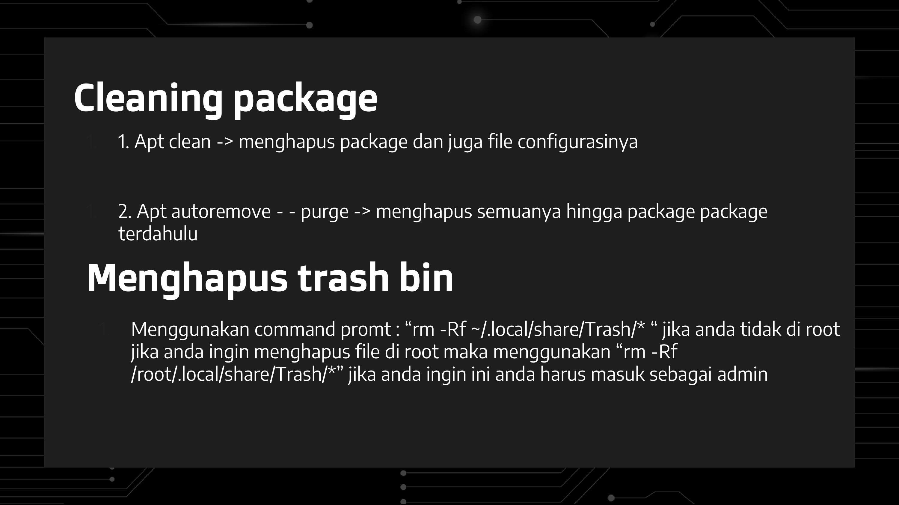
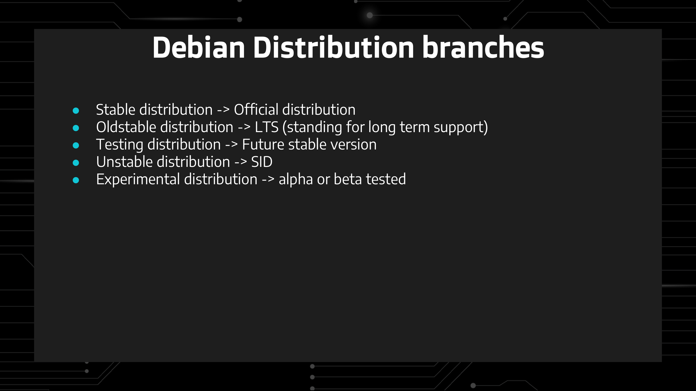

    
    
<strong>Slide 1</strong>

    
    
<strong>Slide 2</strong>

    
    
<strong>Slide 3</strong>

    
    
<strong>Slide 4</strong>

    
    
<strong>Slide 5</strong>

    
    
<strong>Slide 6</strong>

    
    
<strong>Slide 7</strong>

    
    
<strong>Slide 8</strong>

    
    
<strong>Slide 9</strong>

    
    
<strong>Slide 10</strong>

    
    
<strong>Slide 11</strong>

    
    
<strong>Slide 12</strong>

    
    
<strong>Slide 13</strong>

    
    
<strong>Slide 14</strong>

    
    
<strong>Slide 15</strong>

    
    
<strong>Slide 16</strong>

    
    
<strong>Slide 17</strong>

