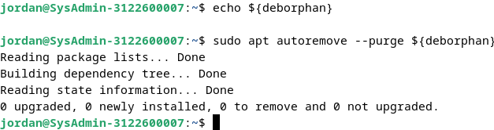

# 8.6: Cleaning The System

### 8.6.1 Disk Space Information

Berikut merupakan beberapa command atau tools yang bisa digunakan untuk mengecek ruang pada disk.  

#### Command `$ df -h`

Command ini digunakan untuk **mengetahui penggunaan kapasitas disk** pada setiap *mount point* (drive dan partisi) pada siste.  

    
    
<strong>Gambar 1:</strong> command df -h

#### Command `$ du` dan `$ sort`

Digunakan untuk **mengecek seberapa *bulky* direktori** yang terdapat pada sistem dalam satuan megabyte.  

    
    
<strong>Gambar 2:</strong> command du & sort

#### NCDU

Merupakan software *disk analyzer* dalam mode konsol. Sebelum dapat menggunakan software ini harus menginstall terlebih dahulu dengan command `$ sudo apt update && sudo apt install ncdu` lalu ketikkan command `$ ncdu` untuk membukanya.  

    
    
<strong>Gambar 3:</strong> ncdu

#### Baobab

Sama seperti NCDU, bedanya Baobab merupakan GUI dan terintegrasi dengan GNOME. Instalasinya sama seperti NCDU dengan mengetikkan command `$ sudo apt update && sudo apt install baobab` lalu command `$ baobab` digunakan untuk menjalankan software tersebut.  

    
    
<strong>Gambar 4:</strong> Baobab

### 8.6.2 Cleaning The Packages

Berikut merupakan beberapa command atau tools yang bisa digunakan untuk melakukan pembersihan package.  

#### Command `$ apt clean`

Command yang berfungsi untuk **membersihkan cache** dari package yang terinstall pada sistem. 

    
    
<strong>Gambar 5:</strong> apt clean

#### Command `$ apt autoremove --purge`

Berfungsi untuk **menghapus package beserta file confignya** dari sistem.  

    
    
<strong>Gambar 6:</strong> apt autoremove --purge

#### Command `$ apt list` dan `$ apt remove`

Berfungsi untuk **menghapus package obsolete** dari sistem.  

    
    
<strong>Gambar 7:</strong> apt list dan `$ apt remove`

#### Deborphan

Selain `$ apt remove`, kita juga bisa menginstall Deborphan yang berfungsi untuk **menghapus *orphaned* package** dari sistem.  

    
    
    
<strong>Gambar 8 & 9:</strong> deborphan

### 8.6.3 Emptying The Trash Bins

Berikut merupakan beberapa command atau tools yang bisa digunakan untuk membersihkan trash bin. Trash bin terdiri dari beberapa tipe, seperti **user wastebasket** milik pengguna biasa dan **administrator wastebasket** milik penguna root.  

#### The User Wastebasket

Berikut command untuk membersihkan trash bin milik user.  

    
    
<strong>Gambar 10:</strong> user trashbin

#### The Root Wastebasket

Berikut command untuk membersihkan trash bin milik user root.  

    
    
<strong>Gambar 11:</strong> root user trashbin

### 8.6.4 Purging Application Caches

Beberapa aplikasi menggunakan direktori cache untuk menyimpan file grafis dan beberapa informasi lainnya supaya bisa berjalan lebih cepat. Biasanya cache tidak memakan banyak ruang disk, tetapi jika direktori cache tersebut menjadi terlalu besar maka bisa dihapus untuk menyisakan ruang disk. 

#### Command

Berikut adalah command untuk menghapus file cache. 

    
    
<strong>Gambar 12:</strong> cache

### 8.6.5 Purging The Thumbnails

Thumbnails merupakan representasi dari file grafis seperti gambar atau video yang disimpan pada suatu direktori untuk digunakan ulang. Hal ini dapat menimbulkan masalah ketika user menghapus suatu file grafis, dikarenakan file thumbnailsnya yang masih tersimpan dan dapat memakan ruang disk hanya untuk menyimpan file obsolete. 

#### Command

Berikut adalah command untuk menghapus file thumbnails. 

    
    
<strong>Gambar 13:</strong> thumbnails

> Terima Kasih
